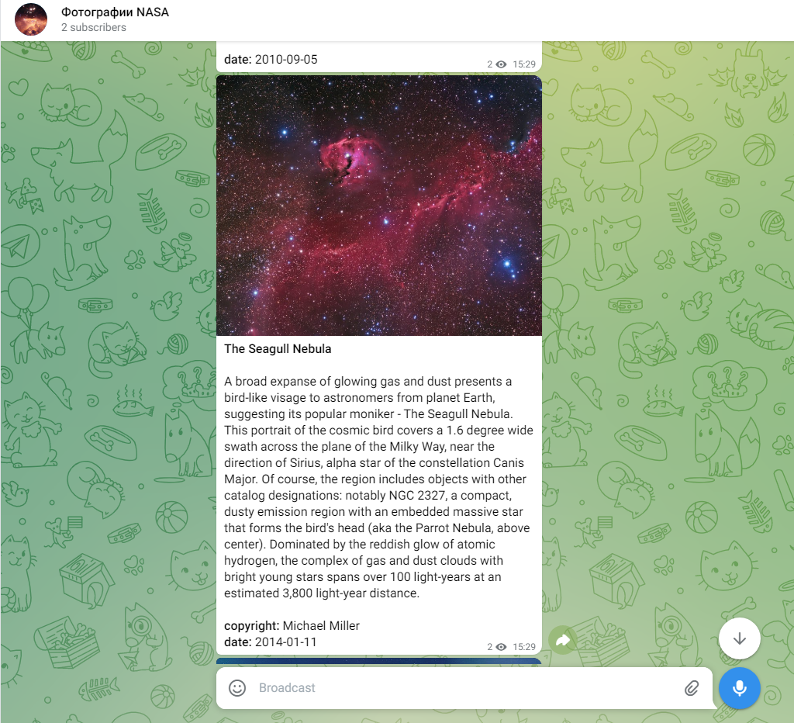

# Телеграм бот, публикующий фотографии космоса



### Порядок действий

1. Скачайте проект:<br>

```commandline
git clone https://github.com/NankuF/nasa_telegram_bot.git
```

2. Перейдите в директорию:

```commandline
cd nasa_telegram_bot
```
3. Создайте виртуальное окружение:<br>

```commandline
python -m venv venv
```

4. Активируйте виртуальное окружение:<br>
Unix
```commandline
. ./venv/bin/activate
```
Windows
```commandline
. .\venv\Scripts\activate
```
5. Установите зависимости:<br>

```commandline
pip install -r requirements.txt
```

5. Создайте бота, канал и добавьте бота в канал с правами администратора.<br>
6. Создайте файл `.env` и укажите следующие переменные:<br>

```text
NASA_API_KEY=your_api_key
TG_TOKEN=your_telegram_bot_token
CHAT_ID=@your_channel
INTERVAL=24
```

`NASA_API_KEY` - ключ для NASA создается здесь: https://api.nasa.gov/ <br>
`TG_TOKEN` - токен для телеграм-бота создается в телеграм-канале: https://t.me/botfather <br>
`CHAT_ID` - название вашего чата, начинается с `@`. Например `https://t.me/botfather` = `@botfather`<br>
`INTERVAL` - интервал публикации, в часах.<br>
7. Используйте скрипт для автопостинга или ручного постинга фотографий в телеграм-канал.<br>

#### Автопостинг фотографий APOD в телеграм-канал
*Ключи необязательны, если их не указать - подставятся значения из `.env`*

`--apikey` - ключ к сервисам NASA.<br>
`--token` - токен телеграм-бота.<br>
`--chat_id` - имя вашего телеграм-канала, например ``@mychannel``.<br>
`--interval` - интервал между публикациями фотографий, в часах.<br>

```commandline
python apod_auto_posting.py --apikey "DEMO_KEY" --token "1234567800:FFHjtoY1pGrk9NGq19LBj1cbe08Hbui9WLx" --chat_id "@nasa_spacex_images_channel" --interval 1 
```
или
```commandline
python apod_auto_posting.py --interval 1 
```

#### Ручной постинг фотографий APOD в телеграм-канал

`--apikey` - ключ к сервисам NASA.<br>
`--token` - токен телеграм-бота.<br>
`--chat_id` - имя вашего телеграм-канала, например ``@mychannel``.<br>

```commandline
python apod_manual_posting.py --apikey "DEMO_KEY" --token "1234567800:FFHjtoY1pGrk9NGq19LBj1cbe08Hbui9WLx" --chat_id "@nasa_spacex_images_channel"
```
или
```commandline
python apod_manual_posting.py
```

### Запуск приложения в докере на сервере
1. Добавить на сервер файл .env
2. Создать и запустить контейнер 
```commandline
docker run -d --name nasa_telegram_bot --restart always --env-file .env nanku/nasa_telegram_bot
```
